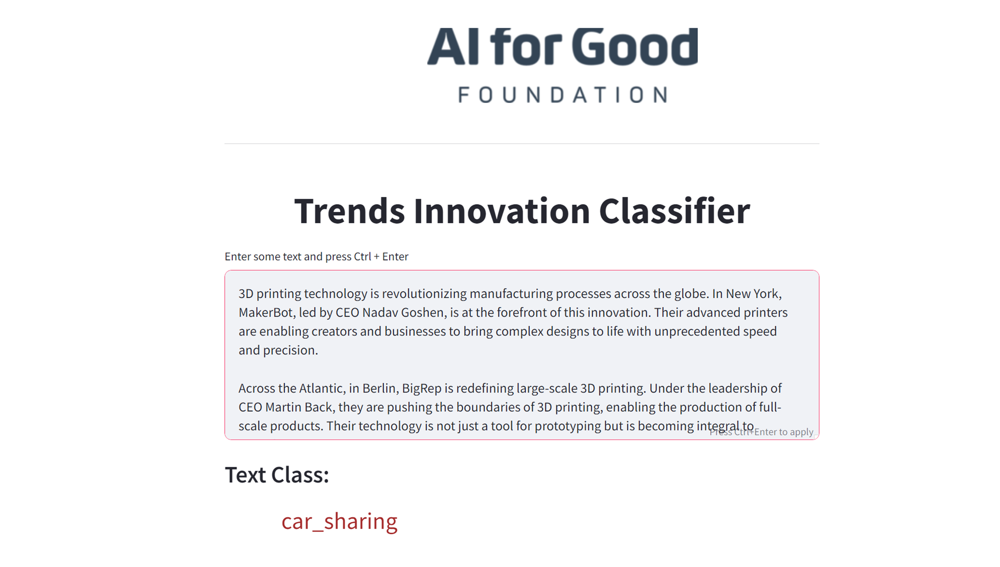

# Climate Trend Scanner App 
## Introduction
This repository contains the Climate Trend Scanner, a Streamlit application developed in Python. It's designed to provide insights into climate trends and innovations.

## Installation Steps

### 1. Clone the Repository
First, clone the repository to your local machine:

`git clone [repository URL]`

### 2. Create a Python Environment
This application is developed using Python 3.11.5. Create a Python virtual environment:

`python -m venv venv`

### 3. Activate the Python Environment
Before proceeding, ensure you are in the `climate-trend-scanner` root folder. Activate the Python environment:

### 4. Install Requirements
Install all the necessary requirements by running:

`pip install -r .\requirements.txt`

### 5. Add .env File
Create a `.env` file in the root directory and add the following content:

`TRENDSCANNER_ENTITY_EXTRACTION_KEY=[Your Key Here]`

### 6. Add the Model Binary File
Due to GitHub's file size limit, the `pytorch_model.bin` file needs to be manually added. Place this file in the following directory:

`\climate-trend-scanner\app\trends_innovations_classifier\checkpoints\distilbert-base-uncased`

### 7. Run the Application
Finally, start the Streamlit app by running:

`streamlit run app\app.py`

On the first run, some additional packages will be installed. After this, the app will be accessible in your web browser at `http://localhost:8501`.

### Screen Examples:

